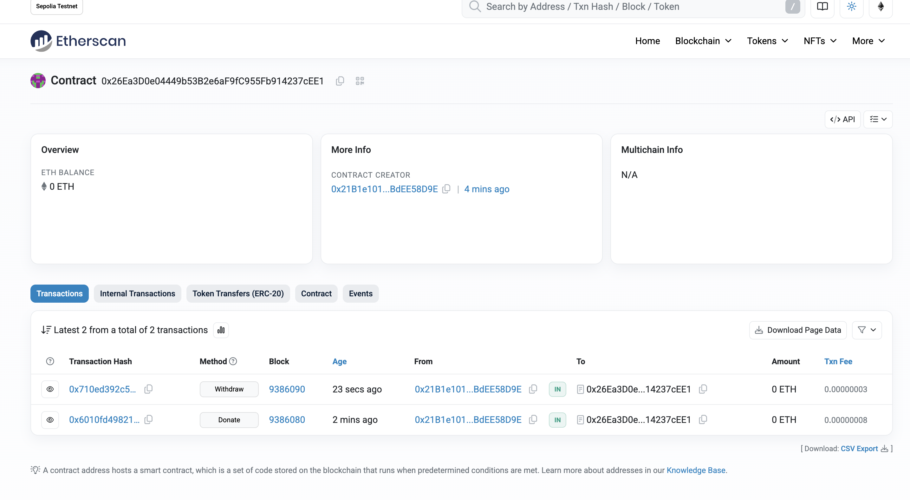

# 作业 1：ERC20 代币

代码：hw1/GkToken.sol

需求：参考 openzeppelin-contracts/contracts/token/ERC20/IERC20.sol实现一个简单的 ERC20 代币合约。要求：

    合约包含以下标准 ERC20 功能：

    balanceOf：查询账户余额。

    transfer：转账。

    approve 和 transferFrom：授权和代扣转账。

    使用 event 记录转账和授权操作。

    提供 mint 函数，允许合约所有者增发代币。

    提示：

        使用 mapping 存储账户余额和授权信息。

        使用 event 定义 Transfer 和 Approval 事件。

        部署到sepolia 测试网，导入到自己的钱包

# 作业2：在测试网上发行一个图文并茂的 NFT

代码：hw2/GkNft.sol

合约地址：0x20D8f7eAa646b7572B2bB50aa6505b90A8aFC3b4

# 作业 1：作业3：编写一个讨饭合约

代码： hw3/BeggingContract.sol

合约地址：0x26Ea3D0e04449b53B2e6aF9fC955Fb914237cEE1

